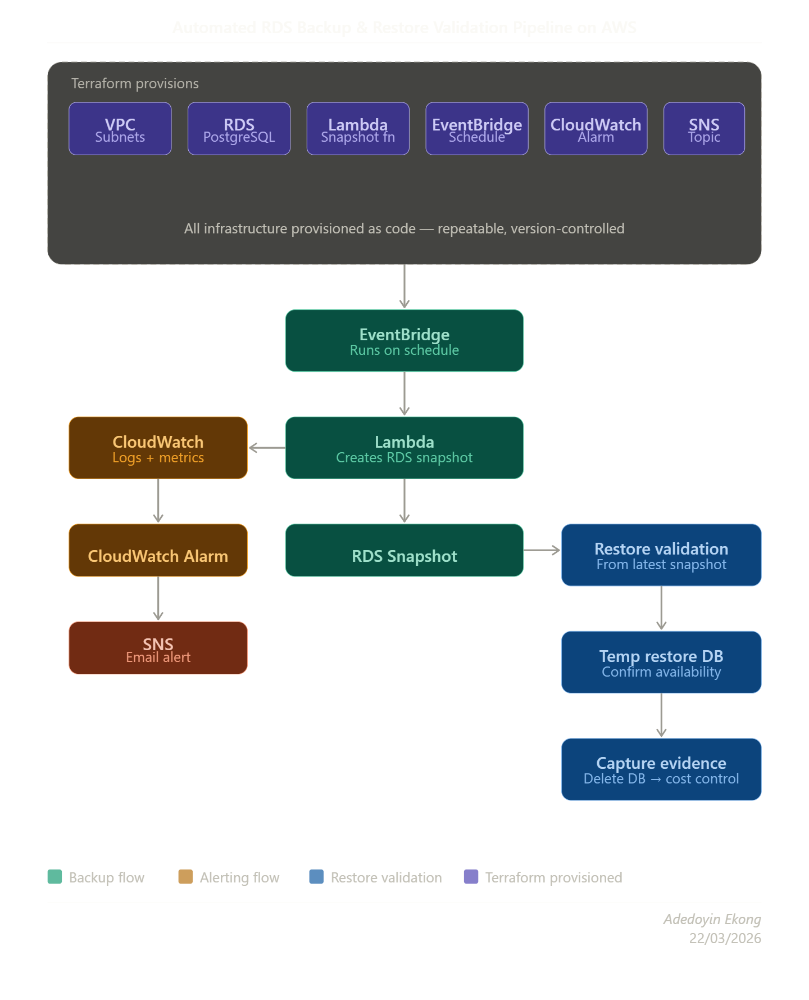

# 🛡️ Automated RDS Backup & Restore Validation Pipeline on AWS

## Overview

This project demonstrates how to build a lightweight disaster recovery and backup validation workflow on AWS using Terraform and AWS-native services.

The goal was not just to create backups, but to prove that backups can be restored, monitored, and validated in a way that reflects real operational thinking.

The solution includes automated RDS snapshot creation, scheduled execution with EventBridge, failure alerting with CloudWatch and SNS, and restore validation by creating a temporary PostgreSQL instance from a snapshot.

## Objectives

- Automate backup creation for an AWS RDS PostgreSQL database
- Schedule backup jobs with EventBridge
- Monitor backup failures with CloudWatch
- Send email notifications with SNS when backup jobs fail
- Validate recoverability by restoring the latest snapshot to a temporary database
- Control cost by deleting temporary restore infrastructure after validation
- Provision the environment with Terraform

## Architecture Diagram

This architecture shows how Terraform provisions the AWS resources, EventBridge schedules the backup workflow, Lambda creates manual RDS snapshots, CloudWatch monitors execution, SNS sends failure alerts, and restore validation is performed using a temporary PostgreSQL instance before cleanup.

The project uses the following AWS services:

- **Amazon RDS PostgreSQL** for the primary database
- **AWS Lambda** for snapshot automation
- **Amazon EventBridge** for scheduling backup jobs
- **Amazon CloudWatch** for logs and alarms
- **Amazon SNS** for email alerting
- **Terraform** for infrastructure provisioning

## Workflow

1. Terraform provisions the networking, RDS instance, SNS topic, Lambda function, EventBridge rule, and CloudWatch alarm.
2. EventBridge triggers the Lambda function on a schedule.
3. Lambda creates a manual snapshot of the RDS database.
4. CloudWatch captures logs and monitors Lambda errors.
5. SNS sends an email notification when the CloudWatch alarm enters the ALARM state.
6. A restore validation test is performed by restoring a snapshot into a temporary PostgreSQL instance.
7. The temporary restore-test database is deleted after validation to reduce cost.

## Tools and Services Used

- Terraform
- AWS RDS PostgreSQL
- AWS Lambda
- Amazon EventBridge
- Amazon CloudWatch
- Amazon SNS
- VPC, subnets, route tables, and security groups

## Project Phases

### Phase 1 — Base Infrastructure

Provisioned the following with Terraform:

- VPC
- Public and private subnets
- RDS PostgreSQL instance
- SNS topic

### Phase 2 — Automated Snapshot Backups

Built a Lambda function that creates manual RDS snapshots and triggered it using EventBridge.

Validated the phase by:
- manually invoking the Lambda function
- confirming successful execution
- verifying the manual snapshot in the RDS console
- confirming the EventBridge schedule exists

### Phase 3 — Alerting and Failure Monitoring

Created a CloudWatch alarm for Lambda errors and connected it to SNS email notifications.

Validated the phase by:
- intentionally breaking the Lambda configuration
- confirming the function failed
- verifying the CloudWatch alarm entered the ALARM state
- confirming the SNS email alert was received
- restoring the correct configuration and verifying the Lambda succeeded again

### Phase 4 — Restore Validation

Validated backup recoverability by restoring the latest RDS snapshot into a temporary PostgreSQL instance.

Confirmed:
- the restore was successful
- the restored database reached the `Available` state
- the original and restored databases existed side by side during validation

The restore-test database was deleted afterward to control cost.

## RPO and RTO

For this demo project, I used the following recovery targets:

- **RPO (Recovery Point Objective):** 24 hours  
  This means the acceptable maximum data loss window is one day.

- **RTO (Recovery Time Objective):** 30 to 60 minutes  
  This means the target recovery time for restoring the database from snapshot is under one hour for the demo environment.

## Evidence and Screenshots

Each phase includes its own screenshot evidence folder for easier review.

- [Phase 1 Evidence](rds-dr-pipeline/docs/screenshots/phase-1/README.md)
- [Phase 2 Evidence](rds-dr-pipeline/docs/screenshots/phase-2/README.md)
- [Phase 3 Evidence](rds-dr-pipeline/docs/screenshots/phase-3/README.md)
- [Phase 4 Evidence](rds-dr-pipeline/docs/screenshots/phase-4/README.md)
- [Phase 5 Evidence](rds-dr-pipeline/docs/screenshots/phase-5/README.md)

## Lessons Learned

- Backups are not enough unless restores are tested
- Alerting is essential for backup reliability
- Temporary restore validation is a practical way to prove recoverability without building a complex DR platform
- Terraform makes the solution repeatable and easier to explain
- Cost control matters when testing disaster recovery workflows

## Cleanup

To avoid unnecessary cost:
- the restore-test database should be deleted after validation
- snapshots should be reviewed and cleaned up as needed
- Terraform resources should be destroyed when the demo environment is no longer needed

## Future Improvements

- Automate restore validation with Lambda or Step Functions
- Add snapshot retention cleanup logic
- Add cross-region backup replication
- Add a more detailed operational runbook
- Add architecture diagrams
- Extend validation to include database connectivity checks
