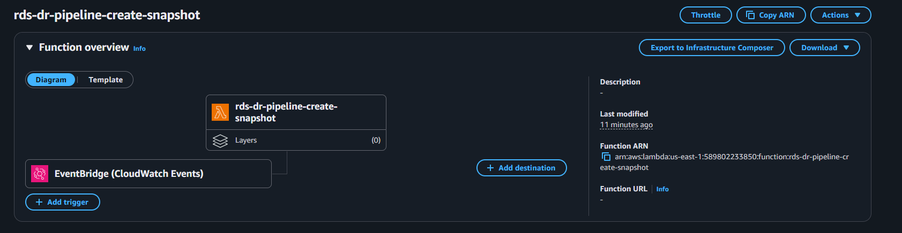
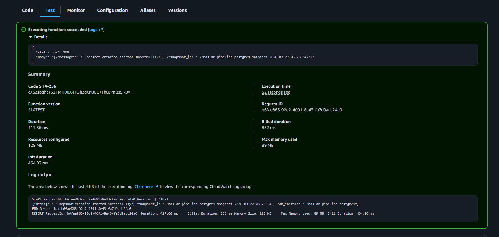
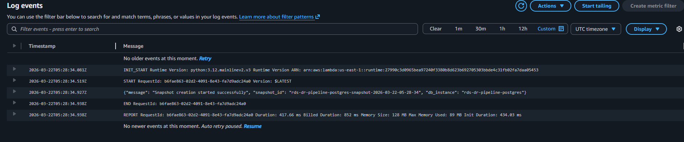
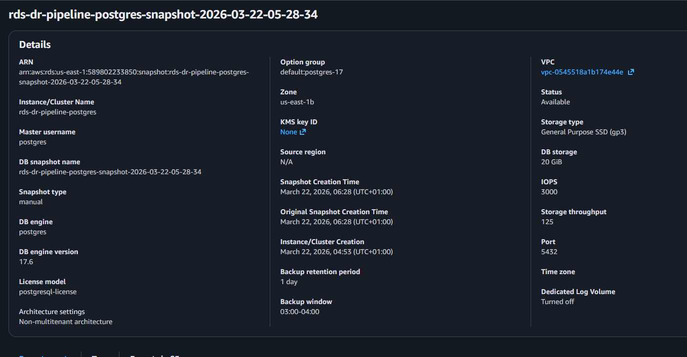
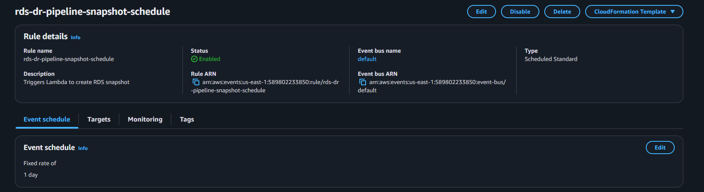
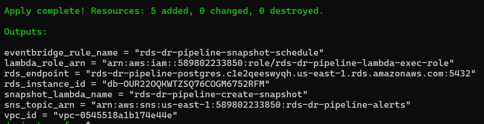

# Phase 2 — Automated Snapshot Backups Evidence

This phase validates automated manual snapshot creation using Lambda and EventBridge.

## Screenshots

### Lambda Overview

### Lambda Test Success

### CloudWatch Logs

### RDS Manual Snapshot

### EventBridge Rule

### Terraform Apply

