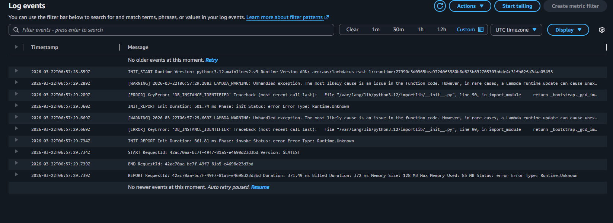
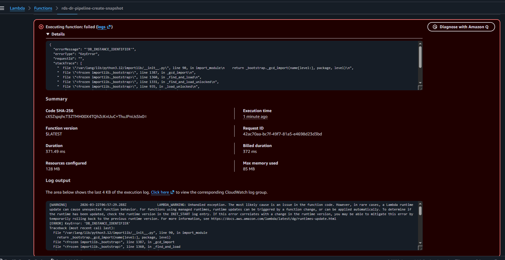
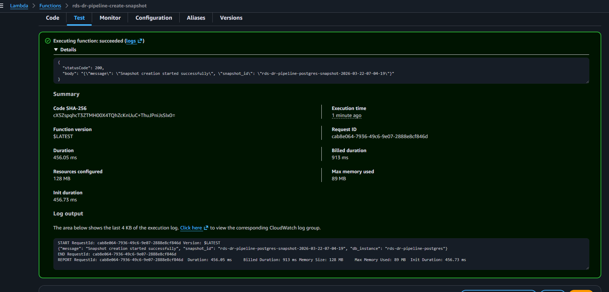
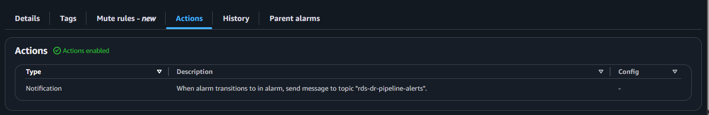
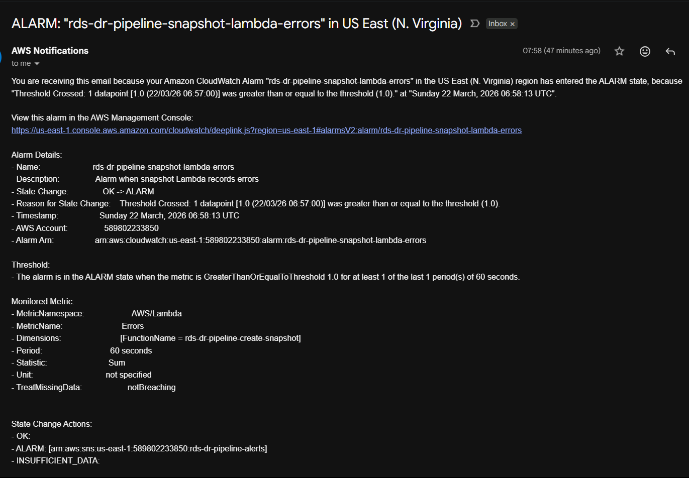

# Phase 3 — Alerting and Failure Monitoring Evidence

This phase validates Lambda error detection, CloudWatch alarms, and SNS email notifications.

## Screenshots

### CloudWatch Alarm Details

### Lambda Failed Test

### Lambda Working Again After Fix

### SNS Action Configuration

### SNS Email Alert

