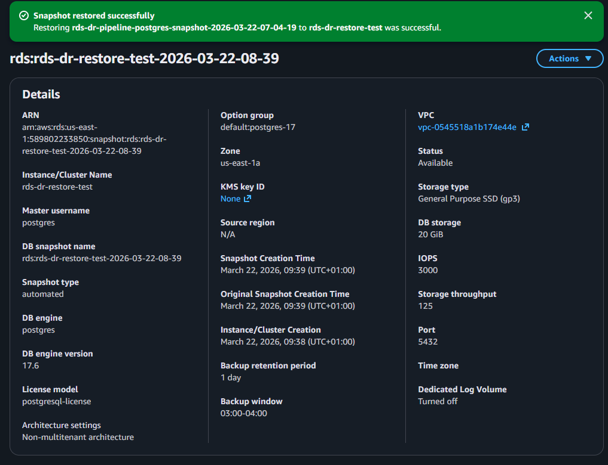
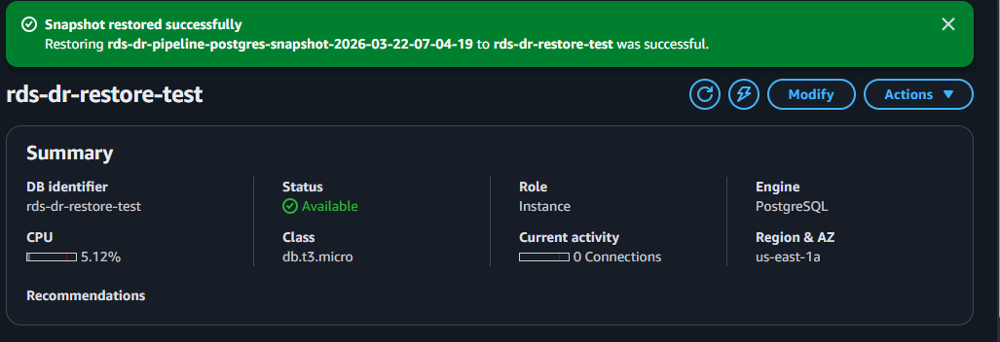
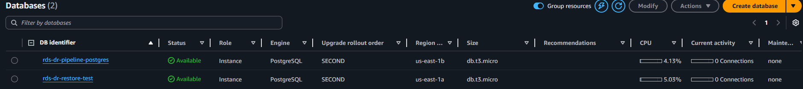
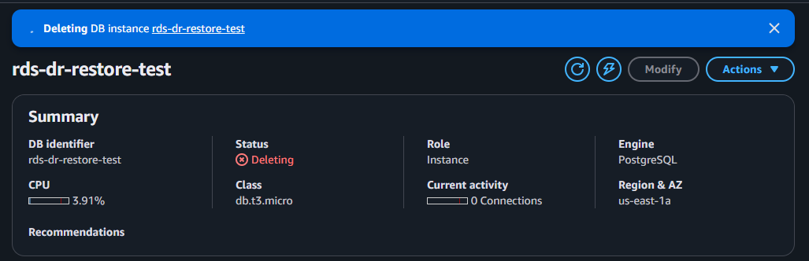

# Phase 4 — Restore Validation Evidence

This phase proves that backups are usable by restoring the database and validating the restored instance.

## Screenshots

### Restored DB Details

### Restored DB Available

### Original and Restored DB Side by Side

### Optional Restore-Test DB Deletion Evidence

