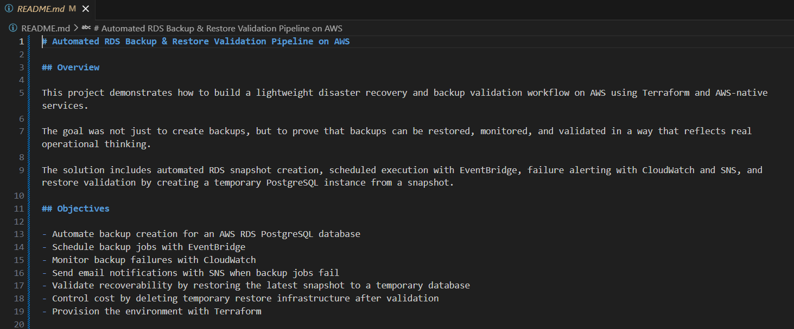
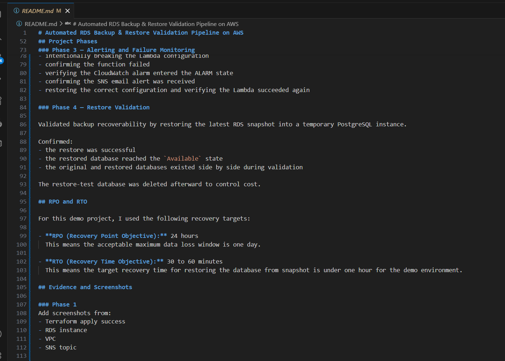
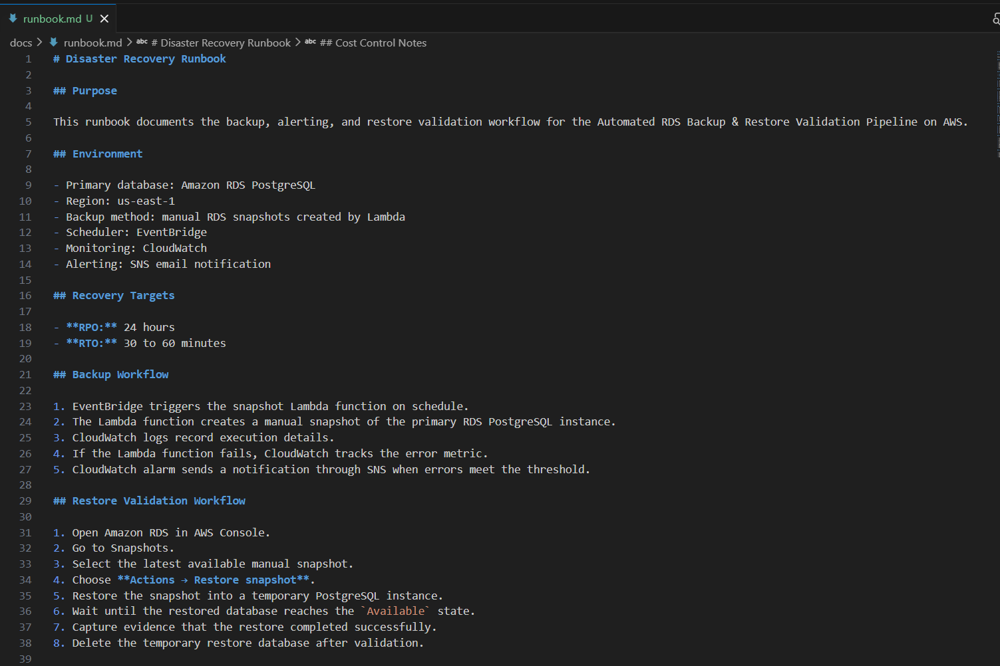

# Phase 5 — Documentation and Final Packaging Evidence

This phase captures the final documentation for the project, including the completed main README, the evidence section, and the disaster recovery runbook.

## Screenshots

### Main README Top Section

### README Evidence Section

### Disaster Recovery Runbook

